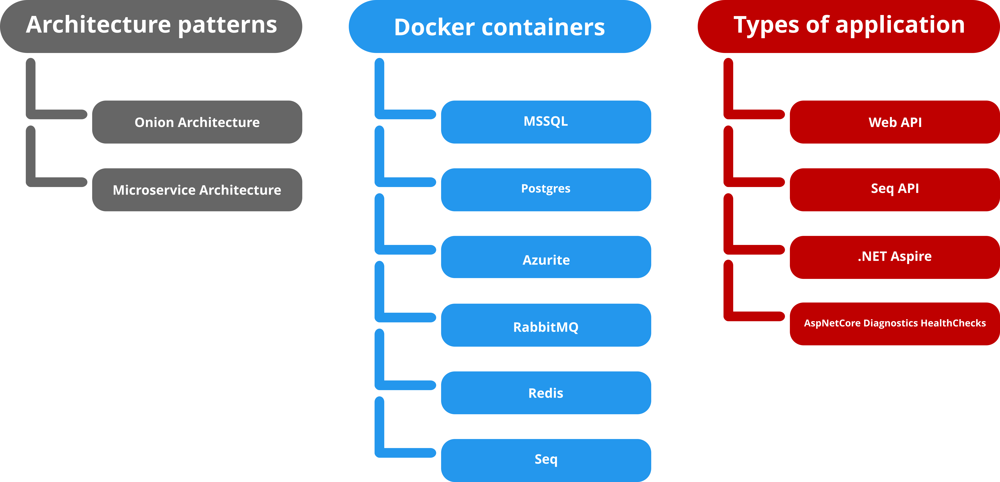
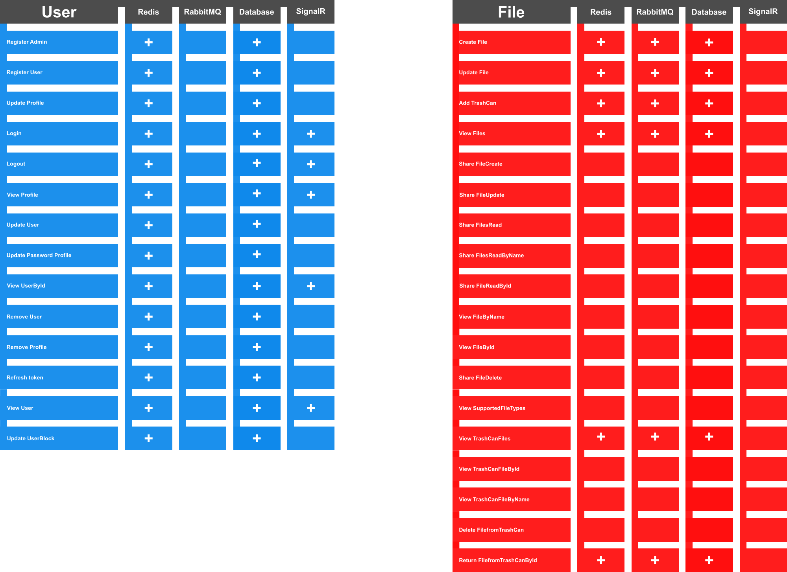
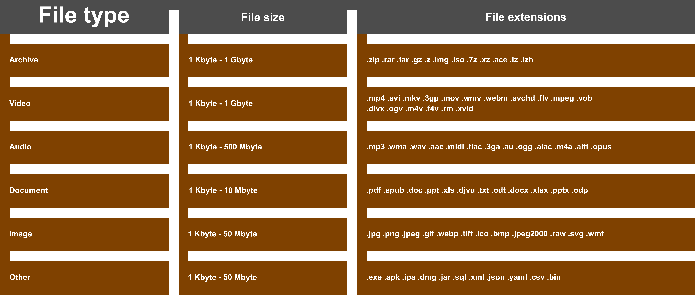
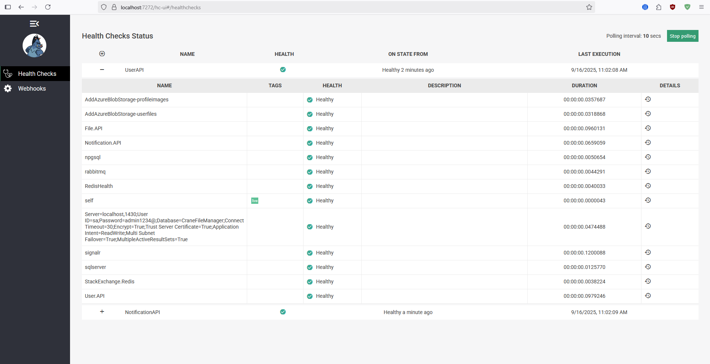

  

 

# Sketch

 

     
 
 

 
 

 

 
 

 
 

<h1> SQL </h1>
<a href="./Assets/Databases/CraneFileManager.sql">CraneFileManager SQL file</a>
 
 

 
 

<h1> Health Checks </h1>
 
 

 
 

<h1> Configuration </h1>
<a href="./Assets/README/Configurations.md">Configurations</a>